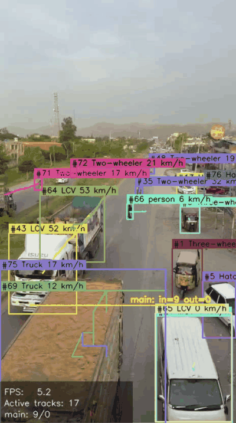
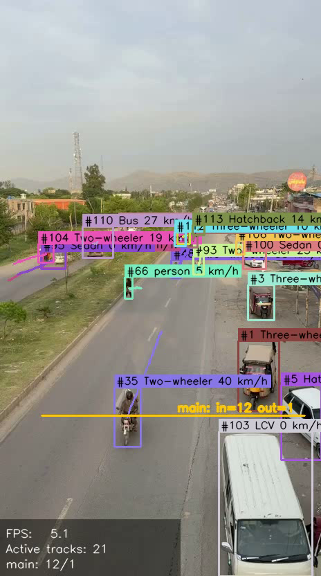
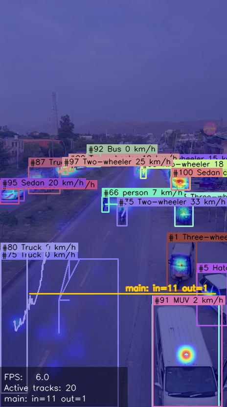

# VisionFlow

A traffic camera at one intersection sees thousands of vehicles a day. Most of that footage just sits on a hard drive. VisionFlow turns it into the kind of data you can actually do something with: how many cars went through, how fast they were going, where they piled up.

It runs anywhere you have Python and a video file (or a webcam, or an RTSP stream). One command in, an annotated video and a CSV of every track out.



*Real output: YOLOv8n + IoU tracker on a public highway clip, 8 simultaneous IDs at peak, line-counter ticking over as cars cross.*

## What it does

Four things, glued together by one config file:

1. **Detection** — YOLOv8 picks out the objects in each frame.
2. **Tracking** — a small IoU-based tracker assigns each object a stable ID so you can follow it across frames.
3. **Analytics** — counters watch lines you draw on the image, a homography turns pixels into meters so you get speeds in km/h, and a heatmap accumulates motion over time.
4. **Output** — annotated video, CSV log, optional live preview, and a Streamlit dashboard if you want charts.

The point is the analytics are decoupled from the source. Same code does cars on a highway, shoppers in a Target, or forklifts in a warehouse — only the YOLO weights and the line coordinates change.

## Quick look

Tracking with stable IDs and a counting line — mixed South Asian street traffic with auto rickshaws (`Three-wheeler`), trucks, sedans, two-wheelers and pedestrians all classified separately:



Heatmap overlay showing where motion accumulated over the clip. The trails trace the real paths every tracked vehicle and pedestrian drove or walked:



A short loop of the live pipeline output:


> The screenshots and GIF above are real frames produced by this codebase on a busy ~20-second highway clip from Taxila, Pakistan, with per-vehicle speed shown in km/h. The pipeline runs the IISc UVH-26 detector (14 South Asian vehicle classes including `Three-wheeler`) for vehicles and stock `yolov8n.pt` restricted to `person` for pedestrians; a rider on a two-wheeler is counted as one vehicle, not a duplicate person. Reproduce them with `python scripts/download_models.py && python scripts/capture_real_screenshots.py` — the capture script writes everything to `docs/img/`.

## Getting started

```bash
git clone https://github.com/Tariqbaloch786/visionflow
cd visionflow
pip install -e ".[app,dev]"

# (optional, recommended) fetch the South Asian traffic detector weights
python scripts/download_models.py

# generate a starter config and run it
visionflow init-config my.yaml
visionflow run --config my.yaml --source path/to/video.mp4
```

That's the whole thing. By default you'll get `outputs/run.mp4` (the annotated video) and `outputs/tracks.csv` (one row per track per frame).

### Detection on South Asian traffic (auto rickshaws etc.)

The COCO-trained `yolov8n.pt` has no class for three-wheelers, so an auto rickshaw gets misclassified as `truck`, `car`, or `motorcycle` depending on angle. To fix that, the sample config uses **IISc's UVH-26** (YOLOv11-S, fine-tuned on Indian traffic, 14 classes including Three-wheeler) as the primary detector, and runs stock `yolov8n.pt` as a secondary detector for the `person` class only — so you get accurate vehicle classes *and* pedestrians from the same pipeline.

Run `python scripts/download_models.py` once to fetch the UVH-26 weights into `models/uvh26.pt`. To fall back to COCO-only, delete the `secondary_detector:` block in your config and point `detector.weights` at `yolov8n.pt`.

If you'd rather use Docker:

```bash
docker build -t visionflow .
docker run --rm -v $(pwd)/examples:/app/examples visionflow run -c examples/sample_config.yaml --no-show
```

## How it's wired together

```
                  ┌──────────────┐
   video stream ─▶│   Detector   │── boxes ─┐
                  │  (YOLOv8)    │          │
                  └──────────────┘          ▼
                                    ┌──────────────┐
                                    │   Tracker    │── tracks ─┐
                                    │ (greedy IoU) │           │
                                    └──────────────┘           ▼
                                                       ┌──────────────┐
                                                       │  Analytics   │
                                                       │  - lines     │
                                                       │  - speed     │
                                                       │  - heatmap   │
                                                       └──────────────┘
                                                              │
                                                              ▼
                                              annotated video + CSV + dashboard
```

Each stage is a class with a small interface. Want to swap the IoU tracker for ByteTrack? Replace one file. Want to add a new analytics module? Drop it in and call its `update(tracks)` from the pipeline. The pieces don't know about each other.

## Speed estimation in one paragraph

You click four image points enclosing a known patch of road — say a 3.5 m × 12 m lane segment. VisionFlow computes a homography that maps pixels to ground-plane meters, projects each track's centroid onto that plane, and divides world-space distance by elapsed time. A short ring buffer smooths out detector jitter. This is the standard single-camera approach and it works well enough for traffic studies; accuracy depends on how flat the road actually is in your calibrated quad and how carefully you click the corners.

## Configuration

Everything lives in one YAML file. The defaults are reasonable; the only fields you really have to set are `source` and `lines`.

```yaml
source: "0"   # webcam id, file path, or rtsp:// url

detector:
  weights: yolov8n.pt
  conf: 0.30
  classes: [2, 5, 7]   # COCO ids: car, bus, truck

tracker:
  iou_threshold: 0.30
  max_age: 30
  min_hits: 3

lines:
  - name: north
    start: [0, 400]
    end:   [1280, 400]

speed:
  enabled: true
  image_quad:
    - [560, 360]
    - [720, 360]
    - [900, 600]
    - [380, 600]
  world_size_m: [3.5, 12.0]
  fps: 30.0

heatmap:
  enabled: true
  decay: 0.92

output:
  video: outputs/run.mp4
  csv:   outputs/tracks.csv
  show:  true
```

Run `visionflow init-config my.yaml` and you'll get a populated starter file you can edit.

## Where this is actually useful

Same pipeline, different verticals — change the weights and the zones:

- **Traffic engineering** — vehicle counts by direction, speed studies in school zones, congestion heatmaps for signal-timing decisions.
- **Retail** — footfall at entrances, dwell-time heatmaps to compare store layouts, queue-length alerts.
- **Warehouses and yards** — forklift speed compliance (OSHA caps it at 8 mph), dock throughput, human/vehicle conflict zones.
- **Construction sites** — PPE and headcount checks, equipment utilization, perimeter access.
- **Wildlife and agriculture** — fish-ladder counts, livestock crossings, tractor coverage in fields.
- **Sports** — player tracking and positional heatmaps from broadcast or fixed-cam angles.

The interview pitch is one line: *one analytics primitive, infinite verticals — the boring parts (typed configs, pluggable stages, tests, CI, Docker) are what make it portable*.

## Running the dashboard

```bash
streamlit run src/visionflow/app.py
```

Pick a config, hit Run, watch the frames stream in. Counts update live as the video plays.

## Development

```bash
make dev      # editable install with extras
make test     # 17 unit tests, runs in under a second
make lint     # ruff
make type     # mypy
make docker   # container build
```

CI runs lint, type-check, the test suite, and a Docker build on Python 3.10, 3.11, and 3.12 for every push.

## What it doesn't do

I'd rather be honest about the edges than oversell:

- The IoU tracker has no appearance model. If two cars fully occlude each other, IDs can swap. Fine for sparse highway scenes, not great for crowded crosswalks. Swap in ByteTrack or DeepSORT if you need that.
- Speed estimation assumes the calibrated quad lies on a flat ground plane. Hills and bumpy lots will throw it off.
- YOLOv8n on CPU runs ~5 to 10 FPS at 640 px. For HD real-time you need a GPU, or export to ONNX/TensorRT (on the roadmap).
- The Streamlit dashboard is single-user and not meant for production deployment. It's there so you can demo the pipeline quickly.

## Roadmap

- ByteTrack and OC-SORT as drop-in alternatives
- Interactive quad picker for camera calibration
- Per-class breakdowns in the analytics output
- ONNX / TensorRT export for edge deployment
- WebRTC streaming output

## License

MIT. See [LICENSE](LICENSE).
